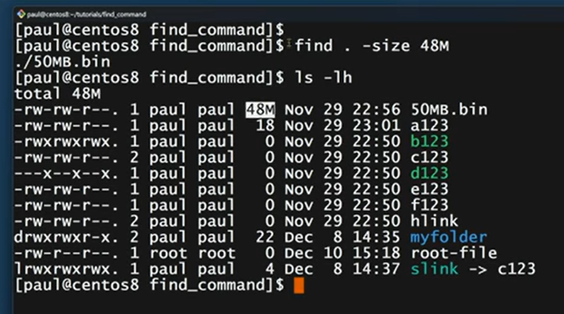

# ShellScriptingPractice


- Name your script with `.sh` extension or just the name of the filename anything works fine 

## SheBang 

```bash

#!/bin/bash

```

- when running scripts in linux it must know which interpreter to use to run that script `shebang` provides exactly that

## Output to terminal 

```bash 

echo "hello" "world" "ok" # Take multiple strings and outputs them to the terminal (stdout)

print "hello" # takes only one string and outputs to the terminal 

``` 


## Executing Shell scripts 

```bash 

./scriptname

# or 

./scriptname.sh 

# or 

/home/ubuntu/myscripts/myscript.sh

# or 

bash script.sh 

# or 

sh script.sh 

```

Note: `bash script.sh` or `sh script.sh` works even if there is not `x` permission set on the script

## Variables 

```bash 

VARIABLE_NAME=value

VARIABLE_NAME=$(hostname)  # command substitution stores the output of linux command hostname

echo $VARIABLE_NAME # To access value of variable and output it on terminal

```

## readonly variables 

```bash 

readonly VARNAME=value

echo $VARNAME

```

## Arrays 

```bash 

array_name=(value1 value2 value3)

echo $array_name

```

Accessing elements , operations on arrays 

```bash 

echo ${array_name[index]}

echo ${array_name[*]} # To print the complete array  this also works ${array_name[@]}

echo ${#myarray[*]} # To print the length of the array

echo ${myarray[-1]} # prints the last element negative indexing 

echo ${myarray[*]:1} # print the sliced array from the 1st index element 

echo ${myarray[*]:1:3} # print 3 elements from the 1st index 

# updateing arrays 

array_name+=(value1 value2)

```

Arrays for storing key-value pairs like object 

```bash 

declare -A array_name

array_name=( [key1]=value1 [key2]=value2 )

# access via keyname instead of index 

echo ${array_name[key1]}

```

## Strings 

```bash 

Variable_name="value" 

Variable_name='value' 

Variable_name=value

# To print the length of the string 

echo ${#variable_name}

# String operations 

myvar="Hey Buddy How are you?" 

length=${#myvar}

echo "length of myvar is : $length"

text="yash" 

# convert entire string to uppercase use variable^^
echo "Upper cased version of text is : ${text^^}"

# convert entire string to lowercase use variablename,, 
echo "Lower cased version of text is : ${text,,}"

# replace a word with other in a string  (It is case sensitive)

echo "replace hey with hi in myvar : ${myvar/Hey/hi}"

# slice of a string 
echo "slice : ${myvar:4}"


echo "slice 2 :   ${myvar:4:5}" # 2nd param is how many characters from the passed first index

# so this gets 5characters from the 4th index 


new_var=$(echo "$myvar"  | sed 's/hey/hi/gi') 

echo "Replaced sentence : $new_var"

echo "Replaced = $(echo $myvar | sed 's/hey/yo/gi' )" # command substitution 

```

## User Interaction 

```bash 

echo "Your name ?:" 

read name

echo $name 

read -p "what is your name ?" name

echo $name 


```

## Arthematic operations 

```bash 


#!/bin/bash 

x=2
y=3 

echo $y + $x # dosnt work just prints the value of variables 

# To evaluate 

echo $((x+y))


echo $(($x + $y))  # works without $ as well when you use $(())

echo " Addition : $((x+y))" 

echo " Addition2 : $(($x+ $y))"

let b=$x*$y

let b1=x*y
echo "Multiplication : $b  $b1"

```

## Conditionals

**if-else , elif** 

```bash 

#!/bin/bash 

read -p "Enter your marks" marks 

if [[ $marks -ge 80 ]]
then 
    echo "1st Division" 
elif [[ $marks -ge 60 ]]
then
    echo "2nd Division" 
elif [[ $marks -ge 40 ]]
then
    echo "3rd Division" 
else 
    echo "Fail" 
fi

```

**case** 

```bash 

#!/bin/bash 

echo "Provide a choice"
echo "a)To see current date" 
echo "b)To see all files in current directory" 
echo "c)To see current location" 

read -p "Enter your choice : " choice 

case $choice in 
    a) 
        echo " Today's date is : "
        date 
        echo "Ending ..."
        ;;

    b) 
        ls 
        ;;

    c)  
        pwd
        ;; 

    *)
        echo "Invalid choice" 
        echo "Provide any options from a , b or c"
        ;;
esac 

```

## Loops 

**For Loop** 

```bash 


#!/bin/bash 

for i in {1..10}
do 
    echo "number is $i" 
done 

for name in raju "mighty" "ales" 
do 
    echo "name is ${name^^}"
done

```

```bash 

# infinite loop 

#!/bin/bash 

for ((; ; ))
do 
    echo "hi Buddy" 
    sleep 5s 
done 

```

**While Loop** 

```bash 

count=0 

while [[ $count -lt $num ]]
do 
    echo "Number is again : $count" 
    let count++
done 

```

```bash 

#infinite loop

#!/bin/bash 

while true 
do 
    echo "hi buddy" 
    sleep 2s 
done

```

**Until Loop**

```bash 

a=20

until [[ $a -eq 10 ]]
do 
    echo "Value of a is $a" 
    let a--
done 

```

## Functions 

```bash 

#!/bin/bash 

# To make a function
function welcome {
    echo "---------------------" 
    echo "hello world" 
    echo "---------------------" 
}

# To call the function (Just type the name of the function)
welcome 
welcome 
welcome

```

```bash 

function myfunc {
    local NAME
    echo $NAME
}

# here local means this variable is accessible only within this function outside this function variable NAME wont be accessible

```

```bash 

my_function() {
    local temp="hello"  # Only visible here
    echo "$temp"
}
my_function
echo "$temp"  # Prints nothing

```


```bash 

#!/bin/bash 

# This is another way to make a function in shell scripts
welcome(){
    echo "------------------------" 
    echo $SHELL;pwd
    echo "------------------------"
}

# To call the function just mention the function name
welcome 
welcome

```

- Passing arguments

```bash 

#!/bin/bash 

function welcomeNote {
    echo "---------------------------" 
    echo "Wecome $1" 
    echo "This is $0 file"
}

welcomeNote raju 
welcomeNote gucci

```

```bash 

my_function() {
    if [ some_condition ]; then
        return 0  # Success
    else
        return 1  # Failure
    fi
}

my_function
status=$?  # Capture exit status
echo "Status: $status"
```

```bash 

get_name() {
    echo "John"
}

name=$(get_name)  # Captures output
echo "$name"  # Prints: John

```

## Arguments in scripts 

- `$0` represents the filename/scriptname
- `$1` represents first argument passed as command line argument
- `$#` represents the count of number of arguments passed to this script 
- `$@` represents all the arguments passed to a script as an array
- `$?` is used to represent the exit status of the previous ran linux command 0 represent successful execution of command and non-zero means unsuccessful command 


- `exit` or `exit <exit_code>` is used to stop a script used in if_else 

- `dirname fileAbsolutepath` gives the directory path striping the main file

- `basename fileAbsolutePath`  gives only the filename stripping the directory info

- `realpath filename` gives the full absolute path of the file 

- `if [[ -d folder_name ]]` checks if folder exists 

- `if [[ ! -d folder_name ]]` check if folder not exists 

- `if [[ -f file_name ]]` if file exists 

- `if [[ ! -f file_name ]]`  if file not exists 

```bash 


#!/bin/bash 

FILEPATH=$(pwd)/yash.txt

if [[ ! -f $FILEPATH ]]
then 
    echo "File Doesn't exist"
    echo "Creating file" 
    touch $FILEPATH
else 
    echo "File Exists"
fi


FILEPATH2=$(pwd)/test

if [[ ! -d $FILEPATH2 ]]
then 
    echo "directory not found" 
    echo "Creating directory..." 
    mkdir -p $FILEPATH2
else 
    echo "directory exists" 
fi


```

**Bash Variables** 

- `RANDOM` - returns A Random integer between 0 and 32767 is generated 

- `UID` - User ID of the user logged in 


```bash 

#!/bin/bash 

for _ in {1..20}
do 
    echo "Random no : $RANDOM" 
    echo "UID : $UID" 
done


no=$(($RANDOM % 6 + 1 ))
echo "Random number is : $no " 

if [[ !  $UID -eq  0 ]]
then 
    echo "Please login as root user" 
else 
    echo "Login Successful" 
fi 

```

## Linux Redirects 

- you want redirect the output of any linux command to a file we can use the > (stdout) 

```bash 

ls > output.txt # writes the output of ls command into output file 

hostname > output.txt # > overides the content so only hostname is stored now 

# To Append use >> 

uname -o >> output.txt 

```


| Symbol | Represents | Example |
| --- | --- | --- |
| > | stdout (Stores Output of command (overriding))  | cd /root > output.txt |
| >>  | stdout (Stores Output of command (Appending)) | hostname >> output.txt  |
| 2> | write only stderr i.e only errors ignore output stdout | cd /root 2> error.txt  |
| &>  | writes both output (stdout) and errors (stderr) | cd /root &> output.log |


- lets say you dont want to store the output (stdout) nor the errors (stderr) you can write /dev/null its ignored 

```bash 

ping -c 1 www.google.com >> /dev/null # This way we dont see the output on terminal and no output or errors are shown in terminal nor stored in any logs 
 
```

## Debugging  Shell Scripts 

- `set -x` To run the script in debug mode which shows which command ran and its corresponding output 
- `set -e` To exit the script whenever any command fails immediately 
- `set -o pipeline` To exit when any command fails in pipelines 

```bash 

#!/bin/bash 

set -e # If you want to exit script when a command fails  
set -x # to run script in debug mode

pwd 

cd /root 

hostname

uname -o  

```

- Together use these 3 in scripts for best practices and better scripts 

## Running Scripts in background 

`nohup` command is used to run scripts in background making sure the script keep running even if the terminal session your using is closed 

**Syntax** 

`nohup script_name &`

- This redirect both errors and output to a file name nohup.out running the script in background 
- if you want to discard the output and error use this 

`nohup script > /dev/null 2>&1 &` 

- This discards both the output (stdout) and the errors (stderr) from the script and runs the script in background even if terminal closes 

## Automating Scripts 

- `at` is used for scheduling one time task i.e should run at 12:00 AM (Not repitive doesn't run everyday)
- `crontab` is used to schedule repitative tasks that should run everyday or every week or every month 

```bash 

at 12:00 AM

at> echo "Hello world" > output.txt
at>EOF (ctrl + D)

```

`crontab -l` lists all cron jobs setup for the current user 

`crontab -e` opens crontab editor to add a new cron job

```bash

05 12 * * * cd /workspaces/ShellScriptingPractice/BashScripts/ && ./automation_cron.sh

```


## Log Rotation 

- Rotation , compression and deletion of logs 
- logrotate provides these utility install it 

```bash 

sudo apt update && sudo apt install logrotate

```

`/etc/logrotate.conf` - contains common config for all log files edit it as per requirements 

`/etc/logrotate.d` - contains all applications specific logrotate config for new log file create a file named with the same name as app (convention)

- For each file in `/etc/logrotate.d` you will find this config customize as needed 

```bash 

/var/log/apt/history.log {
  rotate 12
  monthly
  compress
  missingok
  notifempty
}q

```

- logrotate -d (debug mode) simulates the rotation process without making changes, 

```bash 
logrotate -d /etc/logrotate.conf 

# or if your a non root user use sudo if applicable via sudoers  

sudo logrotate -d /etc/logrotate.conf 

```


- To manually trigger the logrotate you 

```bash 

logrotate /etc/logrotate.conf

# or if not root user 

sudo logrotate /etc/logrotate.conf

```

logrotate itself triggers this automatically at a specific time 
To check that

```bash 

systemctl status logrotate.timer

```

## anacron 

- Anacron is used to schedule periodic tasks in Linux systems that are not running 24/7, such as personal computers 
- Ideal for tasks that need to run daily , weekly or monthly,but not at a fixed time each day 

- Anacron checks once a day to see if there are any jobs scheduled to run that day. If the system was off at the scheduled time, Anacron will run the missed tasks as soon as the system is back up 

**Install** 

```bash 

#Ubuntu/Debian 
sudo apt install anacron 

#RHEL/Fedora 
yum install anacron

```

`/etc/anacrontab` - To check the configuration of anacron jobs 

```bash

15 5 backup_trigger /tmp/backup.sh

# Here 

# 15 means the period (evey 15 days)

# 5 is the delay before the script starts 

# backup_trigger is just a name given to this job 

# Actual shell sctipt 

```

Trigger this anacron job manually for test via 

```bash 

sudo anacron -fdn

``` 

Else they run automatically dont need to trigger manually 

## Rsync 

- Rsync is used to primarily tranfer files between two servers either local to remote or remote to remote 

**Syntax** 

```bash 

rsync -v filename/sourcepath username@hostname:/destinationpath

```

- Other Options : 
    -v - To show verbose details of the transfer
    -z - To compress and send file 
    -a - To archive and send preserves the files permissions as well 

## Vi or Vim Editor 

- To open a file in vim editor 

`vim filename` 

- To open the file in read only mode 

`vim -R filename` or `view filename` 

- If your already inside vim editor and want to make file readonly 

`:set readonly`

`:set noreadonly`

| Symbol | Represents | Use case |
| --- | --- | --- |
| i | Insert mode | To write content  |
| esc + : | Command mode | To execute command like save to new file |
| :wq! | Save and Exit | -  |
| :q! | Exit without saving | - |
| Shift + g | To go to end of the file | -  |
| gg | To go to beginning of file | - |
| /word  | Forward Search | To search for a specific word from top of the file |
| ?word  | Backward Search | To search for a specific word from the end of file |
| n | For next occurence  | -  |
| *  | Forward search the word cursor points to | - |
| #  | Backward search the word cursor points to | -  |
| :%s/currentword/newWord/g | To replace a word globally in the file | -  |
| u | To undo a change | - |
| ctrl/cmd + r  | To redo a change |  |
| o | To start editing in the next line |  |
| Shift + o  | To start editing the above line from the current cursor |  |
| Shift + i  | To start editing from the beginning of the line |  |
| Shift + a  | To start editing from the end of line |  |
| x | To delete a character where cursor is present |  |
| r | To replace a single character where cursor is present |  |
| dd | To delete a line where cursor is pointing to (Its cut actually not delete) |  |
| :e! | To undo all the changes (Multiple changes) |  |
| 15dd | Deletes 15lines from the current cursor |  |
| p | To paste the copied/cut content |  |
| Shift + p | To paste above the current line (cursor) |  |
| Shift + v  | To select a whole line where cursor is currently at |  |
| v  | To select a character then arrow keys to extend |  |
| y | To copy the selected text |  |
| :set nu | To print the line numbers in file |  |
| :set nonu | To remove the line numbers in file |  |
| :syntax on | To add color-coding in vim editor |  |
| :syntax off | To remove color-coding in vim editor |  |
| :121 | Jumps to 121 line of the file | Works only when you have set nu enabled |
| vim -o file1 file2  | To read multiple files |  |
| ctrl/cmd + w (twice) | To change the file selected |  |
| vim -d file1 file2 | To compare two files (diff) |  |

# awk 

- For text processing 

```bash 

awk -F',' '{print $2,$4}' filename  # prints the 2nd and 4th column of  each line in the file 

awk -F',' '{print $NF}' filename # prints the last column of each line in the file

``` 

## cut 

- For text processing 

```bash 

cut -c1 names.txt # To get the first chracter of each line in the file

cut -c1,5 names.txt # To get the first and the fifth character of each line in the file

cut -c1-5 names.txt # To get first to fifth character in each line of the file 

# For CSV files 

cut -d, -f 2 countries.csv # gets the 2 column (Column numbering starts from 1) of the comma separated values -d is for delimiter ,  

cut -d, -f 2 countries.txt

```


```bash 

ls -ltr | awk '{print $NF}' | cut -c1-2 


```

## find 

- find command searched for files in a directory hierarchy 

**Syntax** 

`find /path/ -name <filename>`

```bash 

find . -name a124 # searches for the file named a124 in the current directory (based on the filename)

```

```bash 

# How to search files based on size ?

# find /path/ -size 50M 

# M for mb , G for gb , K for kb and c for bytes 


find . -size 48M 

# finds all files that are of size minimum of 48MB or above in the current directory

# How to find only files or only directories in a given path ?

# find /path/ -type f 

# f (for file) , d (for directory) , l (for symbolic link) , b (for block device) , s (for socket)

find . -type f # find all files in the current directory 


find /path/ -iname a123 # gets all files ignoring case by filename match a123 or even A123

find /path/ -user root # get all files of root only

find /path/ -iname a* # To get all files that start with letter a 

find /path/ -size 20M # To get all files with size exactly 20MB 

find /path/ -size +20M # To get all files with 20Mb or above size

find /path/ -maxdepth 1 -size +10M # To get all files with above 10mb or 10mb and search for current directory and its directory at one level only 

find /path/  -size +1M -size -50M # all files whose size is inbetween 1Mb to 50mb not 1mb or 50mb

find /path -mtime 15 # search 15 days old files in that directory 

```




## sed 

- sed (Stream Editor) to edit files without opening them 

# Sed Cheat Sheet with Explanations

### Printing Specific Lines or Ranges

- `sed -n '1p' file_name`  
  **Prints only the 1st line** (suppress default output with `-n`, then `p` for print)

- `sed -n '1,5p' file_name`  
  **Prints lines 1 through 5** (range specified as `start,end`)

- `sed -n '$p' file_name`  
  **Prints only the last line** (`$` represents last line)

### Pattern Matching (Print Lines Containing Text)

- `sed -n '/India/p' file_name`  
  **Prints all lines containing "India"** (pattern between `/.../`)

### Multiple Expressions

- `sed -n -e '2p' -e '5p' file_name`  
  **Prints line 2 AND line 5** (`-e` allows multiple expressions)

- `sed -n -e '/India/p' -e '/Germany/p' file_name`  
  **Prints lines containing India OR Germany** (multiple pattern matches)

### Advanced Line Selection

- `sed -n '2,+4p' file_name`  
  **Prints 4 lines starting from line 2** (`+n` means next n lines)

- `sed -n '1~2p' file_name`  
  **Prints every 2nd line starting from line 1** (`~step` for step intervals)

- `sed -f ex_file file_name`  
  **Reads sed expressions from external file** (`ex_file` contains sed commands)

### Substitution (Replace Text)

- `sed 's/<old>/<new>/g' file_name`  
  **Replaces all occurrences of `<old>` with `<new>`** (`s` for substitute, `g` for global)

- `sed '5 s/<old>/<new>/g' file_name`  
  **Replaces text ONLY on line 5** (line number before `s`)

- `sed '5! s/<old>/<new>/g' file_name`  
  **Replaces text on ALL lines EXCEPT line 5** (`!` means not)

- `sed -i 's/<old>/<new>/g' file_name`  
  **Replaces AND saves changes to original file** (`-i` for in-place edit instead of  just printing output on termianal which later you had to collect via > you can just use -i to fo changes to the orginal file)

- `sed '/Paul/ s/25000/35000/g' file_name`  
  **Replaces salary only on lines containing "Paul"** (pattern before `s`)

- `sed '/Paul/ s/24000/32000' filename` 
  **Replaces the first occurrence of 24000 with 32000 only on lines containing "Paul"** (pattern /Paul/ restricts the substitution to matching lines, and no g flag means only the first match per line is replaced).

### Deletion

- `sed '1d' file_name`  
  **Deletes line 1** (`d` for delete)

- `sed '1,2d' file_name`  
  **Deletes lines 1-2** (range deletion)

- `sed '$d' file_name`  
  **Deletes last line**

- `sed '/India/d' file_name`  
  **Deletes all lines containing "India"**

- `sed '/^$/d' file_name`  
  **Deletes all empty lines** (`^$` matches empty lines)

### Text Manipulation

- `sed 's/\t/ /g' file_name`  
  **Replaces all tabs with spaces** (`\t` for tab character)

- `sed -n '/India/ w new_file' file_name`  
  **Writes matching lines to new_file** (`w` for write)

### Insert/Add/Change Lines

- `sed '5 a new_text' file_name`  
  **Adds "new_text" AFTER line 5** (`a` for append)

- `sed '/Paul/ a new_text' file_name`  
  **Adds "new_text" after lines containing "Paul"**

- `sed '5 c new_text' file_name`  
  **Replaces ENTIRE line 5 with "new_text"** (`c` for change)

- `sed '/Paul/ i new_text' file_name`  
  **Inserts "new_text" BEFORE lines containing "Paul"** (`i` for insert)

### Display & Debugging

- `sed -n 'l' file_name`  
  **Shows hidden characters** (`l` like "list" - shows tabs, newlines)

- `sed -n 'l 50' file_name`  
  **Wraps lines at 50 characters AND shows hidden chars**

- `sed '=' file_name`  
  **Prints line numbers** (before each line)

### File Operations

- `sed '3 r externalfile' file_name`  
  **Inserts content of externalfile AFTER line 3** (`r` for read)

### Control Flow

- `sed '/India/ q' file_name`  
  **Stops at first line containing "India"** (`q` for quit)

- `sed '5 q' file_name`  
  **Stops after line 5**

- `sed '/India/ q 100' file_name`  
  **Quits with exit status 100**

- `sed '2 e date' file_name`  
  **Executes external command "date" on line 2** (`e` for execute)

### Sed Regular Expressions

| Pattern | Meaning |
|---------|---------|
| `^` | Start of line |
| `$` | End of line |
| `.` | Any single character |
| `[]` | Match character set |
| `[^]` | NOT character set |
| `*` | Zero or more occurrences |

**Examples:**
```bash
sed -n '/^2/p' file_name          # Lines starting with "2"
sed -n '/ia$/p' file_name         # Lines ending with "ia"
sed -n '/^S...a$/p' names         # 5-letter names: S???a
sed -n '/^V/p' names              # Names starting with V
sed -n '/a$/p' names              # Names ending with a
sed -n '/^[A-D]/p' names          # Names starting with A,B,C,D
sed -n '/[AC]/p' names            # Names containing A or C
```

### POSIX Character Classes
```bash
sed -n '/[[:alpha:]]/p' file      # Alphabetic characters
sed -n '/[[:digit:]]/p' file      # Digits 0-9
sed -n '/[[:alnum:]]/p' file      # Alphanumeric
sed -n '/[[:space:]]/p' file      # Whitespace
sed -n '/[[:lower:]]/p' file      # Lowercase letters
sed -n '/[[:upper:]]/p' file      # Uppercase letters
```

**Pro Tip:** Always use `-n` with `p` to suppress automatic printing!